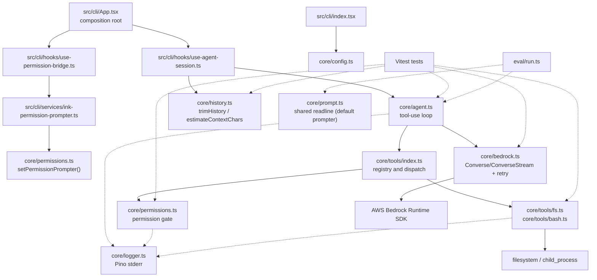

# System Architecture

## Shape

`mini-harness` is a single-process Node.js CLI. `src/cli/` is the driving adapter (an Ink/React app), layered as presentation (`components/`), application state (`hooks/`), and integration glue (`services/`) around a thin `App.tsx` composition root; `src/core/` holds application behavior and external-boundary adapters. There is no database, server, or frontend.

The core does not import `src/cli/` or tests. `core/prompt.ts`'s shared readline interface now backs only `core/permissions.ts`'s `defaultPrompter` — the fallback used by `eval/run.ts`, which never calls `setPermissionPrompter()`. `src/cli/` instead renders its own Ink-native permission prompt (see "Extension seams").

## Turn flow

1. `src/cli/index.tsx` calls `validateConfig(process.env)`, prints returned warnings to stderr, and renders the Ink `<App>` component. `App` is a thin composition root: it calls `usePermissionBridge()` (registers the Ink permission prompter via `setPermissionPrompter()` in a startup effect) and `useAgentSession()` (owns conversation history and turn state), then renders `<TranscriptView>`, `<PermissionPrompt>`, and `<PromptInput>` from `src/cli/components/`.
2. On each submitted line, `useAgentSession()`'s `submit()` calls `runAgent(messages, input, undefined, onAgentEvent, { stream: true })`; `onAgentEvent` also handles `text_delta` events. The `stream` option is an explicit opt-in, not inferred from `onEvent`'s presence — `eval/run.ts` also passes an `onEvent` (for its own tool-progress logging) but omits `stream`, so it keeps using `ConverseCommand` exactly as before. Only a caller that actually renders `text_delta` should turn streaming on.
3. When `stream: true`, the agent calls `converse()` with an `onDelta` callback; `converse()` then uses `ConverseStreamCommand`, forwarding each text content-block delta to `onDelta` (and thus to the UI) as it arrives — for every round of the turn, not only the final one. Without `onDelta`, `converse()` uses `ConverseCommand` unchanged. A `tool_use` response is dispatched sequentially through `executeTool()` so permission prompts cannot interleave.
4. Tool results are appended as one user message; the loop repeats until text is returned or the 25-round cap is reached. `useAgentSession()` tracks streamed text and a progress line per tool call while the round runs, which `<TranscriptView>` renders; a round boundary flushes that round's streamed text into the ordered line buffer first, so a multi-round turn's intermediate text isn't lost or concatenated into the next round's. Once a round or turn resolves, that output is flushed into an Ink `<Static>` list so it's never re-rendered.
5. A failed turn resets message history to its pre-turn length before rethrowing; only the initial `client.send()` for the stream is retried — a failure while iterating the stream itself is not. The streaming path also throws (instead of returning a message with no content) if the stream ends having produced no content blocks, so a malformed/empty stream triggers the same rollback as any other failure rather than corrupting history with an unusable assistant message. `useAgentSession()` reports the error into the transcript and returns to accepting input.
6. After a successful turn `useAgentSession()` records the turn's start index and calls `trimHistory()` from `core/history.ts`, which keeps only the last `MAX_HISTORY_TURNS` (20) turns, cutting exclusively at turn boundaries (always a `user` message) so a tool_use/tool_result pair can never be split. This caps turn count, not payload size — a single turn can still hold up to 25 tool rounds of content.

## Security boundaries

`resolveInWorkdir()` in `core/tools/fs.ts` requires a lexical path inside the starting working directory and confirms the nearest existing ancestor stays within its symlink-resolved real path. It also detects a final dangling symlink before a write can follow it outside the workdir.

`write_file` and `run_command` go through `checkPermission()`. An `always` decision is an in-memory cache key of the exact `toolName:JSON(input)` value. `run_command` is not OS-sandboxed: it runs in the process working directory after permission, retains up to 10 MiB of output, and kills its entire process tree after 30 seconds.

## Bedrock, configuration, and logging

`converse()` retries `ThrottlingException`, `ServiceUnavailableException`, `ModelTimeoutException`, `ECONNRESET`, and `ETIMEDOUT`. It makes at most four attempts using exponential backoff from 500 ms, up to 500 ms jitter, and an 8-second delay cap. Validation, access-denied, and unclassified errors do not retry.

`validateConfig()` warns only when explicitly supplied `BEDROCK_MODEL_ID` lacks a supported inference-profile prefix (`global.`, `us.`, `eu.`, or `apac.`) or a supplied `AWS_REGION` is implausible. Defaults are accepted, and no credential or AWS network check occurs at startup.

Pino writes structured core logs to stderr. At `info`, records include event metadata such as tool name, success, duration, retry attempt, and permission decision. Inputs, outputs, and permission responses are debug-only.

## Verification and deployment

Vitest unit and integration tests mock the Bedrock client or readline where needed and cover the agent loop (including streaming `text_delta` forwarding), retry policy, configuration warnings, permission behavior, workdir containment, and history trimming. **Known gap**: there is no automated test suite for the Ink UI layer (`src/cli/App.tsx` and everything under `src/cli/components/`, `src/cli/hooks/`, `src/cli/services/`) — `ink-testing-library` was explicitly deferred; that layer's only verification is a manual smoke test (`npm start` on a real terminal). GitHub Actions runs `npm ci`, typechecking, formatting, and tests on Node 22 for pushes and pull requests. `eval/run.ts` (`npm run eval`) runs a small fixed task set against live Bedrock through the real permission gate for manual before/after comparison when prompt or agent-loop logic changes; it is not part of CI.

This is a local CLI invoked by `npm start`; it has no deployment artifact, container, or hosted target.

## Extension seams

No plugin system, provider abstraction, or public API exists, by design (see the roadmap's rule-of-three principle). What already supports substitution without new abstraction:

- **Provider boundary**: `core/bedrock.ts` exports a single `converse()` function. Tests replace it wholesale with `vi.mock("../../src/core/bedrock.js")`, or mock `BedrockRuntimeClient.prototype.send` directly for the streaming path — no interface or DI container needed because there is exactly one implementation and one consumer (`core/agent.ts`).
- **Tool boundary**: `core/tools/index.ts`'s registry (a plain object keyed by tool name) is the seam for adding a tool — implement the same shape as `core/tools/fs.ts`/`bash.ts` (`name`, `inputSchema`, `execute`) and register it. `executeTool()` already runs schema validation and the permission gate uniformly for any entry, so a new tool gets both for free.
- **Permission gate**: `core/permissions.ts` now has a real, exercised seam rather than a hypothetical one — `setPermissionPrompter()` swaps `checkPermission()`'s "ask the human" step (typed `PermissionPrompter = (toolName, input) => Promise<"yes" | "always" | "no">`) without touching its caching/scoping logic. `eval/run.ts` never calls it and gets the readline-based `defaultPrompter`; `src/cli/hooks/use-permission-bridge.ts` calls it once at startup to install `src/cli/services/ink-permission-prompter.ts`'s `inkPermissionPrompter`, which bridges the request to a rendered `<PermissionPrompt>` menu. This is the second concrete implementation of the seam (readline, then Ink), which is what justifies documenting it as a real extension point rather than a single-implementation module.

None of these are formal interfaces beyond the permission gate — they're modules that happen to be easy to replace because each has exactly one call site. **When to add a real seam (a defined interface with ≥2 implementations):** only once a second concrete need exists. The permission prompter crossed that line this round; the provider and tool boundaries have not — e.g. a second model provider actually being wired in, or a plugin loading tools from outside the repo at runtime, would justify a formal `interface Provider`/`interface ToolSource`. Until then, introducing one there would be speculative abstraction with no second implementation to validate it against, which this roadmap explicitly avoids.
