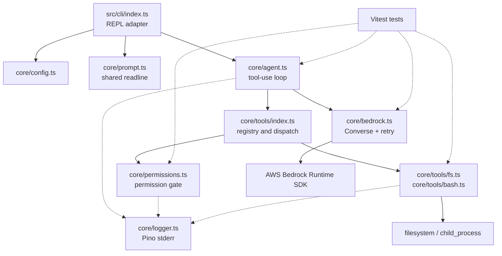

# System Architecture

## Shape

`mini-harness` is a single-process Node.js CLI. `src/cli/` is the driving adapter; `src/core/` holds application behavior and external-boundary adapters. There is no database, server, or frontend.

The core does not import `src/cli/` or tests. `prompt.ts` is core because both the CLI and the permission gate need one readline owner.

## Turn flow

1. `src/cli/index.ts` calls `validateConfig(process.env)`, prints returned warnings to stderr, and reads input through `core/prompt.ts`.
2. It passes the shared message array to `runAgent()`.
3. The agent adds the user message and calls `converse()`. A `tool_use` response is dispatched sequentially through `executeTool()` so permission prompts cannot interleave.
4. Tool results are appended as one user message; the loop repeats until text is returned or the 25-round cap is reached. The CLI passes an `onEvent` handler so it can print a progress line per tool call while the round runs, before the final reply prints.
5. A failed turn resets message history to its pre-turn length before rethrowing; the CLI prints the error and continues its REPL.

## Security boundaries

`resolveInWorkdir()` in `core/tools/fs.ts` requires a lexical path inside the starting working directory and confirms the nearest existing ancestor stays within its symlink-resolved real path. It also detects a final dangling symlink before a write can follow it outside the workdir.

`write_file` and `run_command` go through `checkPermission()`. An `always` decision is an in-memory cache key of the exact `toolName:JSON(input)` value. `run_command` is not OS-sandboxed: it runs in the process working directory after permission, retains up to 10 MiB of output, and kills its entire process tree after 30 seconds.

## Bedrock, configuration, and logging

`converse()` retries `ThrottlingException`, `ServiceUnavailableException`, `ModelTimeoutException`, `ECONNRESET`, and `ETIMEDOUT`. It makes at most four attempts using exponential backoff from 500 ms, up to 500 ms jitter, and an 8-second delay cap. Validation, access-denied, and unclassified errors do not retry.

`validateConfig()` warns only when explicitly supplied `BEDROCK_MODEL_ID` lacks a supported inference-profile prefix (`global.`, `us.`, `eu.`, or `apac.`) or a supplied `AWS_REGION` is implausible. Defaults are accepted, and no credential or AWS network check occurs at startup.

Pino writes structured core logs to stderr. At `info`, records include event metadata such as tool name, success, duration, retry attempt, and permission decision. Inputs, outputs, and permission responses are debug-only.

## Verification and deployment

Vitest unit and integration tests mock Bedrock or readline where needed and cover the agent loop, retry policy, configuration warnings, permission behavior, and workdir containment. GitHub Actions runs `npm ci`, typechecking, formatting, and tests on Node 22 for pushes and pull requests.

This is a local CLI invoked by `npm start`; it has no deployment artifact, container, or hosted target.
